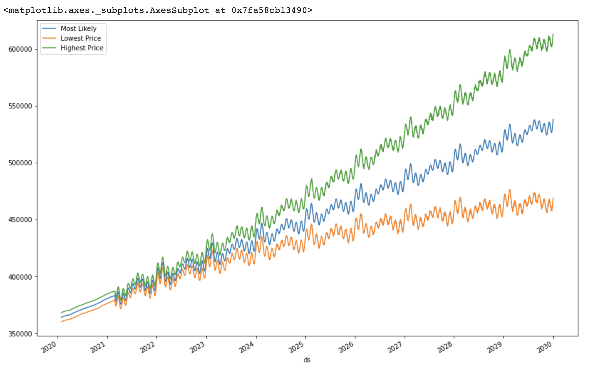
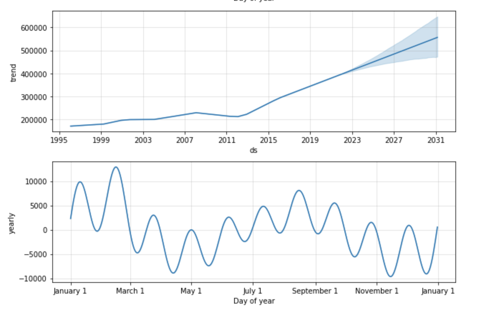

# Fintech Project 2 - Sixth Sense: Real Estate Forecasting using Machine Learning

Purchasing a property is likely the biggest financial decision most of us will ever make in our lives, yet the average consumer doesn’t have access to sophisticated tools for forecasting the future value of property. Enter Sixth Sense: a forecasting tool created to help the average consumer make better investment decisions. Sixth Sense uses Machine Learning to analyze real estate markets across the US and help consumers understand the expected future value of property in hundreds of locations. Sixth sense allows users to type in a city they're interested in purchasing property in. It then returns the current average property value in the selected city, the expected average property value in 10 years, and the expected ROI over 10 years.

### This project is broken into 3 connected parts:
The first two parts of this project live in Google Colab. I've provided links to both Colab files below. The third part of this project lives in Amazon Lambda, which then connects to our Amazon Lex chatbot. I've also provided a link to that. All of these files can also be found in the 'Project_2' folder.

#### Part 1 - Import Data, Clean Data, Run Algorithim, And Visualize Results: 
In the first part of the project, we imported 30 years of property data from thousands of cities in the USA. We used Zillow as our data source and Google Colab to host our notebook. After importing the data, we cleaned and prepared it so that it could be interpreted by FB Prophet. Next we ran it through FB Prophet. Lastly, we visualized the results.
https://colab.research.google.com/drive/1Pa2gi70c5HTbXJAZ4_XmEi6Odctb5Lrn?usp=sharing

#### Part 2 - Iterate Through Every City, Export to JSON:
In Part 2 of this project, we create a function that iterates through every city in the dataset, and then exports that data to JSON format (this file is included in the Project-2 folder). Once its in JSON format, we're able to download it and insert it into our lambda function.
https://colab.research.google.com/drive/1NQ1_A6a0bIjlJclaUv_uLZO99cAUfUK-?usp=sharing

#### Part 3 - Amazon Lambda for Lex Bot:
Part 3 is the final step in our project. Once the JSON data is imported and we have all of our data in the lambda function, we then build out our lambda function so that it is ready to interact with our Lex Chatbot. Once the chatbot is prepared, the user is able to interact with the bot to get information about cities they're interested in buying property in.
https://us-west-2.console.aws.amazon.com/lambda/home?region=us-west-2#/functions/sixth_sense?tab=code

---

## Technologies

Installations:

```python
from IPython.display import clear_output
try:
  !pip install pystan
  !pip install fbprophet
  !pip install hvplot
  !pip install holoviews
except:
  print("Error installing libraries")
finally:
  clear_output()
  print('Libraries successfully installed')
```


Imports:


```python
import pandas as pd
import holoviews as hv
from fbprophet import Prophet
import hvplot.pandas
import datetime as dt
%matplotlib inline 
```

---

## Usage/Examples

### Part 1 
Pat 1 is where we imported our data from Zillow, cleaned it, ran it through FB Prophet, and then visualized the results. The images below are of the visualizations we got from FB Prophet. In these examples we're looking at projections for Austin, Texas. The first image shows the FB Prophet results for yhat, yhat upper, and yhat lower over ten years. The second image shows monthly trends, which are useful for understanding the best time to buy and sell a home.





### Part 2

-Make all the necessary installations and imports, then type in the ticker name you would like to see data for.

-Once ticker is entered, save the file and the dash app will automatically update
-In this section we make the API call and select which columns to pull data from. We'll use an interval of every 5 minutes

-the dataframe is then saved into a CSV file each time a new ticker is selected by the User
-The progeram then reads the saved CSV file

-Next, we have the main setup for the DASH app, and the next section sets up the layout for the DASH app

-Next we setup the DASH app callback for the Indicator Graph. The indicator graph shows the percent change for the stock over the course of the day
-It will either display numbers in green if there was a positive change, or red if there was a negative change in the stocks value over the course of the day

-Next we setup the DASH app callback for the Line Graph. Similarly, it will display a green line with green filling underneath if there was a positive change, or it wil display a red line with red filling underneath if there was a negative change over the course of the day

-The final function that makes the DASH app run
-After the program runs, navigate to this link (http://127.0.0.1:3000/) to run the program. This link will also display in your terminal below


---

## Contributors

UCB Fintech Bootcamp; Wynham Guillemot, Ehab, Peter, Mattheus

---

## License

MIT License

Copyright (c) [2021] [UCB Fintech Bootcamp, Wynham Guillemot, Ehab, Peter, Mattheus]

Permission is hereby granted, free of charge, to any person obtaining a copy
of this software and associated documentation files (the "Software"), to deal
in the Software without restriction, including without limitation the rights
to use, copy, modify, merge, publish, distribute, sublicense, and/or sell
copies of the Software, and to permit persons to whom the Software is
furnished to do so, subject to the following conditions:

The above copyright notice and this permission notice shall be included in all
copies or substantial portions of the Software.

THE SOFTWARE IS PROVIDED "AS IS", WITHOUT WARRANTY OF ANY KIND, EXPRESS OR
IMPLIED, INCLUDING BUT NOT LIMITED TO THE WARRANTIES OF MERCHANTABILITY,
FITNESS FOR A PARTICULAR PURPOSE AND NONINFRINGEMENT. IN NO EVENT SHALL THE
AUTHORS OR COPYRIGHT HOLDERS BE LIABLE FOR ANY CLAIM, DAMAGES OR OTHER
LIABILITY, WHETHER IN AN ACTION OF CONTRACT, TORT OR OTHERWISE, ARISING FROM,
OUT OF OR IN CONNECTION WITH THE SOFTWARE OR THE USE OR OTHER DEALINGS IN THE
SOFTWARE.
